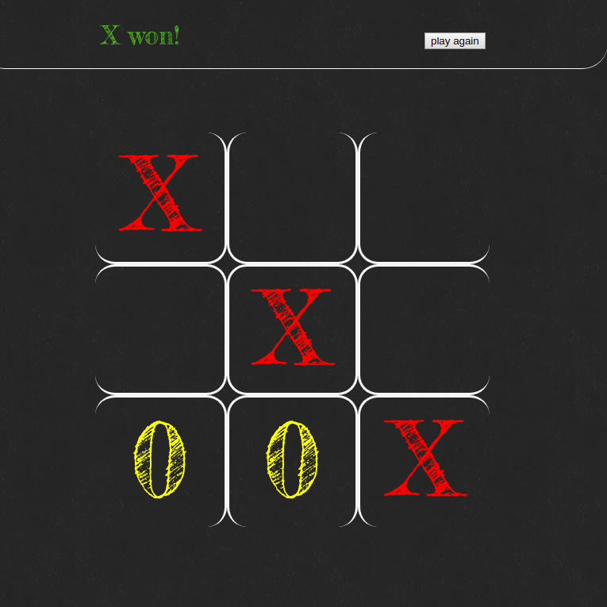

# tcTKte
  Out smart your opponent by getting 3 (:x:'s or :o:'s) in a row.

## Instructions
- install latest version of npm
- clone this repo https://github.com/Buttacavoli01/tcTKte.git
- run ```npm``` i to install dependencies
- run ```gulp run``` 
- navigate to '''http://localhost:3000'''
- grab a friend and play!
- Click on the square to make your mark
- The player with 3  (:x:'s or :o:'s)  in a row either vertial, horizontal or diagnal wins.

## Live Link
https://buttacavoli01.github.io/tcTKte/.



